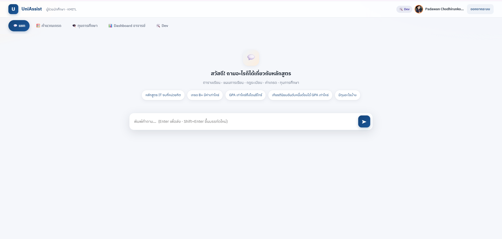
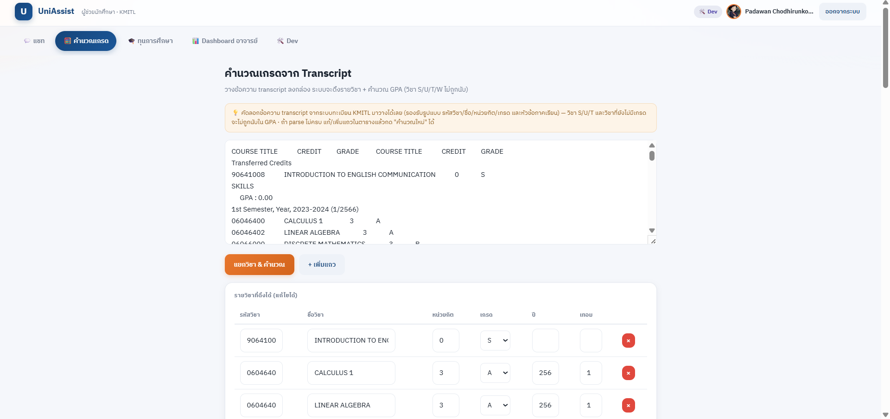
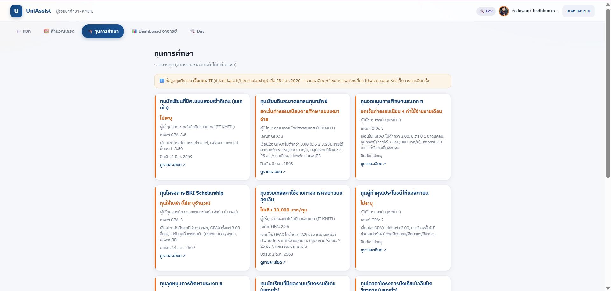

# UniAssist — Academic Assistant for Students (Text-to-SQL Chatbot)

An academic assistant for KMITL students and academic advisors, built with **Flask + LLM**.
Users ask a question in natural language, the LLM writes SQL that runs against a read-only
curriculum database, and the system composes an answer. It also includes a general chat mode,
GPA calculation, a scholarship listing, and an advisor dashboard.

## Key Features

- **Curriculum Q&A (Text-to-SQL)** — the LLM decides for itself whether a question is a data query (SQL) or small talk (CHAT); the UI shows the generated SQL, the raw result table, and the latency of each stage.
- **Chat mode** — answers conversationally while grounded in facts from the database (reducing hallucination), and acts as a fallback when SQL generation or execution fails.
- **GPA calculation** — paste a transcript or edit courses directly in the table to compute term and cumulative GPA, plus academic standing (retirement risk / probation / honors). Grade values and thresholds come from the database rather than being hardcoded.
- **Scholarship listing**
- **Advisor dashboard** — view advisees along with their term-by-term GPA and a risk summary.
- **Google OAuth** — sign in with a Google account restricted to allowed domains, with role separation (student / advisor / dev).

## Demo

**Chat page — curriculum Q&A**



**GPA calculation from a transcript**



**Scholarships**



## Security

Because students write the questions themselves, SQL execution is restricted at several layers:

- The database connection is **genuinely read-only** (`file:...?mode=ro`) — the LLM cannot issue `DELETE` or `UPDATE`.
- Generated SQL is validated to be a single `SELECT`/`WITH` statement; write commands are blocked and multiple statements are rejected.
- A `LIMIT` is added automatically when missing, preventing full-table dumps.
- The Google client secret is read server-side only, and the user is stored in a signed session cookie.

## Project Structure

| File | Purpose |
|---|---|
| `app.py` | Flask web app — routes `/`, `/ask`, `/calc-gpa`, `/scholarships`, `/dashboard-data`, `/dev-info` |
| `text_to_sql_chatbot.py` | Text-to-SQL core: prompt construction, LLM calls, SQL validation and execution, answer composition (also runnable as a CLI) |
| `assist_logic.py` | Shared logic: transcript parsing, GPA calculation, academic standing derived from rules in the database |
| `google_auth.py` | Google OAuth 2.0 plus role-control decorators (`login_required`, `advisor_required`, `dev_required`) |
| `build_qwen_db.py` | Builds a database from the JSON that Qwen extracted from the curriculum tables |
| `build_chatbot_db.py` | Assembles the chatbot database (study plans from Ground Truth, the rest from Qwen) |
| `build_extra_tables.py` | Adds supplementary tables: `grade_scale`, `rules`, `scholarships`, `students`, `student_term_gpa` (idempotent) |
| `templates/` | `login.html`, `index.html` |
| `data/` | Source data (ground truth, extraction output, curriculum tables) |
| `chatbot_teach_table.db` | The main database the app runs on |

## Installation

Requires Python 3.10+

```bash
pip install -r requirements.txt
```

## Configure `.env`

Create a `.env` file in the same folder as `app.py`:

```ini
# LLM (OpenAI-compatible — works with Qwen / DeepSeek / Typhoon / Gemini via OpenRouter, etc.)
LLM_BASE_URL=https://openrouter.ai/api/v1
LLM_API_KEY=sk-...
LLM_MODEL=qwen/qwen3-235b-a22b
LLM_PROVIDER=            # optional (auto-detected)

# Database
DB_PATH=chatbot_teach_table.db

# Google OAuth (see GOOGLE_AUTH_SETUP.md for the full walkthrough)
GOOGLE_CLIENT_ID=...
GOOGLE_CLIENT_SECRET=...
GOOGLE_REDIRECT_URI=http://localhost:5000/auth/callback
FLASK_SECRET_KEY=<a long random string>

# Access control (comma-separated)
ALLOWED_DOMAINS=kmitl.ac.th
DEV_EMAILS=you@kmitl.ac.th
ADVISOR_EMAILS=advisor@kmitl.ac.th
STUDENT_EMAILS=
```

> For detailed Google OAuth setup (creating credentials, redirect URIs), see [GOOGLE_AUTH_SETUP.md](GOOGLE_AUTH_SETUP.md)

## Running

```bash
python app.py
```

Open http://localhost:5000 in your browser (you must sign in with Google before using the app).

### Running the chatbot core from the CLI (for testing / evaluation)

```bash
python text_to_sql_chatbot.py                                  # interactive mode
python text_to_sql_chatbot.py -q "How many credits does the IT curriculum require?"
python text_to_sql_chatbot.py --sql "SELECT ..."               # run SQL directly
```

## Rebuilding the Database (optional)

```bash
python build_qwen_db.py ./data/extracted_teach_table ./qwen_teach_table.db
python build_chatbot_db.py       # assembles chatbot_teach_table.db
python build_extra_tables.py     # adds grade_scale / rules / scholarships / students
```

## Notes

- The `students` and `student_term_gpa` tables currently hold mock data, prepared for a later integration with the registrar API (see [README-2.md](README-2.md) for the real data flow).
- Some LLM providers respond inconsistently (occasionally returning `NO_ANSWER` depending on the time of day) — the system already handles this with retry-on-`NO_ANSWER`.
